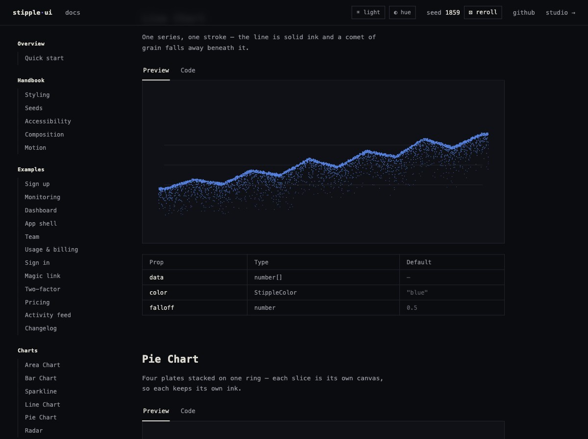
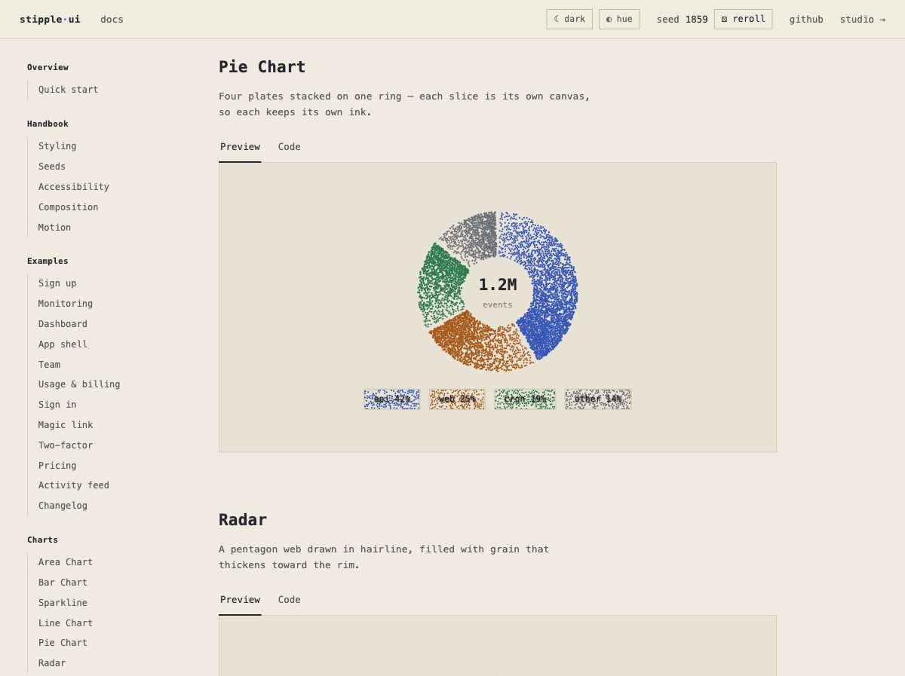
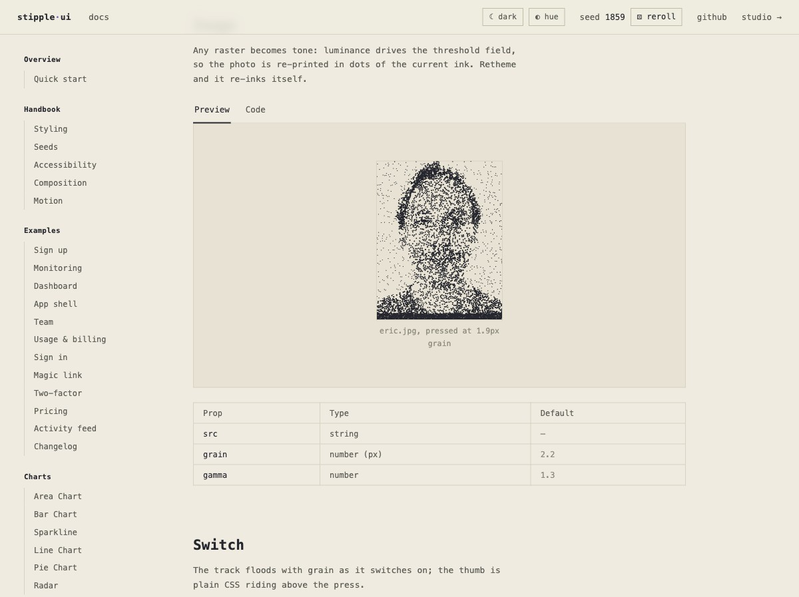
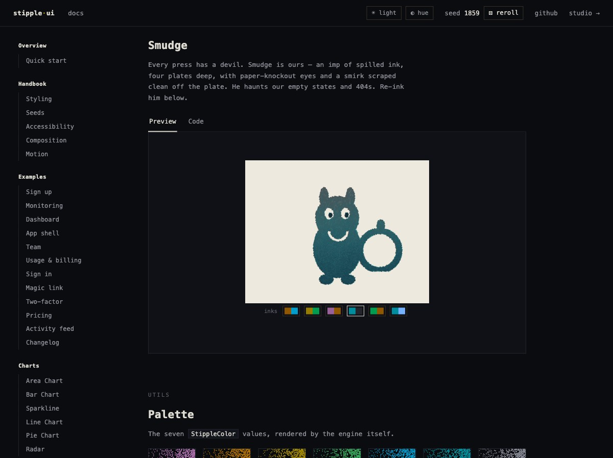

<h1 align="center">Halftone UI</h1>

<p align="center">
  <strong>A component library that ships its own printing press.</strong><br>
  Every surface is <em>printed, not painted</em> — buttons, charts, switches and washes are<br>
  halftone screens pressed onto canvas, the way ink actually lands on paper.
</p>

<p align="center">
  <a href="https://halftone-ui.com/"><b>halftone-ui.com</b></a> ·
  <a href="https://halftone-ui.com/docs/"><b>▶ Docs &amp; live demos</b></a>
</p>

<p align="center">
  <a href="https://github.com/ecgang/halftone-ui/stargazers"></a>
  
  
  <a href="LICENSE"></a>
</p>

<p align="center">
  
</p>

---

## What this is

Most UI libraries **paint**: a fill is a hex value, a gradient is a CSS function, a chart is an SVG path. Halftone UI **prints**. Every fill is a live canvas holding a seeded dot cloud, and each dot carries its own threshold. A component supplies a *tone function* — how dark is the ink at this point? — and the press keeps the dots that tone can reach.

That single operation — threshold a tone field against a screen — **is** what halftone means. It's also the entire library.

```js
// every component is just a tone function 0..1
const meter = surface(canvas, {
  tone: (p, W, H) => (p.x / W < 0.72 ? 0.95 : 0.05),
  pattern: "hatch",
})

// the press: keep the dots whose threshold the local tone can reach
for (const p of dots) {
  if (tone(p) > p.threshold) ink(p)
}
```

The dots come from a **seeded Poisson-disk cloud** — blue noise, which is exactly what stochastic screening uses on a real press. Because the seed is deterministic, a reload gives you the same ten thousand dots; reroll and the whole page reprints at once. Animation never tweens CSS: a value glides, every dot re-tests its threshold, and **the grain itself is the motion**.

It's a loving riff on [dither-ui](https://dither-ui.com/) — same docs-site format, different printmaking tradition.

## Features

- **~90 documented components** — primitives (switch, slider, OTP field, dialogs, menus, combobox), charts (line, pie, radar, area, bars, heatmap, donut, sparkline), and whole page examples (dashboard, pricing, billing, sign-in flows)
- **Four halftone screens** — `hatch` (crosshatch, the default), `stipple` (stochastic/FM), `lines` (line screen), `waves`. Every pressed example carries a picker: re-press it live. Swap the screen and the whole page changes character — the tone field underneath never moves
- **A real four-plate press** — CMYK separation at the true process screen angles (C 15°, M 75°, Y 0°, K 45°), with plate order and adjustable misregistration
- **Global grain dials** — one `▦` control rescales the screen, the ink weight and the washes across every surface on the page at once
- **Real light & dark themes** — a designed print-shop-cream light mode and an archival-black dark mode, not an inversion filter
- **OKLCH hue wheel** — drag a ring in the topbar and every pigment rotates through OKLCH hue space live; neutrals stay neutral
- **Image halftoning** — any raster becomes tone: luminance drives the dot field, so photos re-print in the current ink
- **Smudge** 😈 — the resident ink imp, pressed from the same engine as everything else
- **Zero dependencies, one file** — no build step, no CDN, works from `file://`
- **Accessible** — native elements underneath (`<dialog>`, `<details>`, real inputs), `prefers-reduced-motion` respected

## Gallery

| | |
|---|---|
|  |  |
|  |  |

## Quick start

No install. It's one HTML file.

```bash
git clone https://github.com/ecgang/halftone-ui.git
open halftone-ui/docs/index.html
```

Or just [download `docs/index.html`](https://raw.githubusercontent.com/ecgang/halftone-ui/main/docs/index.html) and double-click it. Everything — engine, docs, demos, themes — is inside.

> [!TIP]
> Try the topbar: `☀` toggles the designed light mode, `◐` opens the OKLCH wheel (drag the ring — the whole site rethemes), `▦` opens the global grain dials, and `reroll` reprints every surface from a new seed.

## Vue / React

The docs show every component with Vue and React snippets. The single-file demo *is* the source of truth for the engine today; packaged builds are on the roadmap.

```vue
<HButton color="purple">Press me</HButton>
```

```bash
npm i @halftone-ui/core   # planned
npm i @halftone-ui/vue    # planned
npm i @halftone-ui/react  # planned
```

## Why "halftone" and not "stipple"

Halftone is the umbrella technique: simulating continuous tone with discrete marks thresholded against a screen. Stippling is a hand-illustration technique — placing dots with a pen. They aren't siblings; one contains the other, and this engine is squarely the former, because its core operation is *threshold-against-a-screen* and hand stippling has no threshold function at all.

Every pattern here maps to a named halftone screen: `stipple` is stochastic (FM) screening — Poisson-disk sampling *is* blue noise, exactly what a real press uses for stochastic screens; `lines` and `waves` are line screens; `hatch` is a crosshatch screen. The press seals it — "misregistration" is a meaningless idea in stippling, and only exists because plates on a press shift.

So `stipple` survives where it's the correct word: as one of the four screens.

## Credits

- Format and spirit: [dither-ui](https://dither-ui.com/)
- Crosshatch inspiration: Texturelabs' Retratone halftone technique
- Engine, docs, and Smudge: built with [Claude Code](https://claude.com/claude-code)

## License

[MIT](LICENSE) © Eric Gang
